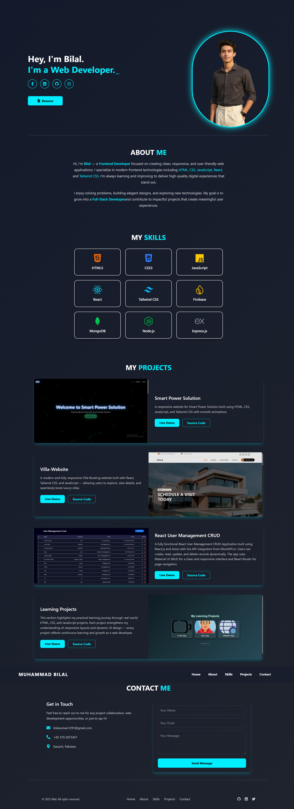

# 🌐 Muhammad Bilal – Personal Portfolio


 

 
 
      
 
Welcome to my **Personal Portfolio**, built with **Next.js + TypeScript**, showcasing my journey as a **Front-End Developer**.    
This website highlights my **skills, projects, and coding expertise**, all wrapped in a **modern, animated, and fully responsive design**. 💻✨

---

## 🌐 Live Demo
 
[](https://imuhammad-bilal.vercel.app/)
 
---

## 🎯 Purpose

This portfolio presents my **professional identity online**, demonstrating my expertise, creative projects, and coding journey in one seamless interface.  
It’s more than a portfolio — it’s a reflection of **my growth as a developer**.

---

## 🖥️ Website Sections

| Section | Description |
|---------|-------------|
| 🏠 **Home** | Hero section with animated intro, typewriter effect, and CTA buttons. |
| 💡 **About** | Overview of my journey, goals, and front-end development story. |
| 🧠 **Skills** | Technical stack: **HTML, CSS, JavaScript, React, Tailwind CSS, TypeScript, Firebase**, etc. |
| 📂 **Projects** | Top projects with **live demos** and **source code**. |
| 📞 **Contact** | Interactive contact form and social links. |

---

## ✨ Key Features

- 🌍 Fully **responsive design** across all devices  
- 🎬 **Smooth animations** with Framer Motion  
- 🧩 **Dynamic project cards** with hover & transition effects  
- 🔗 Smooth **navigation** with scroll animations  
- 💡 Modern **UI/UX layout** inspired by top portfolios  
- 🏷️ **SEO optimized** with proper meta tags & open graph settings  
- ⚡ **Fast performance** with Next.js + optimized assets  

---

## 🖼️ Preview



---

## ⚙️ Setup Instructions

1. **Clone the Repository:**
   
   ```bash
   https://github.com/Bilal742/Muhammad-Bilal.git
3. **Install Dependencies:**
   
   ```bash
   npm install
   or
   yarn
---

3. **Run the Development Server:**
   
   ```bash
   npm run dev
   or
   yarn dev

---

4. **Open in Browser:**
   
   ```bash
   Visit http://localhost:3000

---   

## 👨‍💻 Developer

**Muhammad Bilal**  
📧 [bilalusman1291@gmail.com](mailto:bilalusman1291@gmail.com)  
🌐 [Portfolio](https://imuhammad-bilal.vercel.app/)  
🐙 [GitHub](https://github.com/Bilal742)
