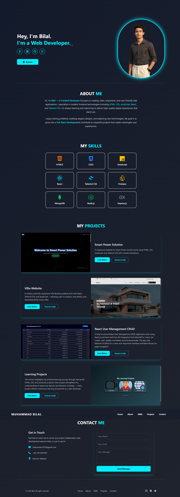

# 🌐 Personal Portfolio Website
  
Welcome to my **Personal Portfolio Website**, designed and developed to showcase my journey as a **Front-End Developer**.  
This website highlights my skills, creative projects, and coding passion — wrapped in a modern, animated, and responsive design. 💻⚡

---
  
## 🎯 Purpose   
The main goal of this portfolio is to **present my professional identity online** — displaying all of my work, technical expertise, and achievements in one elegant and interactive interface.  
It’s not just a portfolio — it’s a reflection of my growth and creativity as a developer.   

---  

## 🖥️ Sections Included

### 🏠 Home  
A modern **hero section** with smooth animations, introduction text, and an engaging call-to-action.

### 💡 About  
A short but meaningful overview of who I am, my goals, and my journey in front-end development.

### 🧠 Skills  
A visually appealing showcase of my technical stack including:  
**HTML**, **CSS**, **JavaScript**, **React**, **Tailwind CSS**, **Firebase**, and more.

### 📂 Projects  
A dedicated section to highlight my **top real-world projects**, each with live demo and source code links.

### 📞 Contact  
A simple and direct **contact section** featuring an email form and quick-access social links.

---

## 🛠️ Technologies Used

| Technology | Purpose |
|-------------|----------|
| **React.js** ⚛️ | For building the front-end structure and interactivity |
| **Tailwind CSS** 🎨 | For modern, responsive, and utility-first styling |
| **Framer Motion** ✨ | For elegant and smooth animations |
| **Responsive Design** 📱 | To ensure perfect viewing experience across all devices |

---

## ✨ Key Features

- 🌍 Fully **responsive** on all screen sizes  
- 🎬 **Animated sections** powered by Framer Motion  
- 🧩 **Dynamic project cards** with hover and transition effects  
- 🔗 Smooth and intuitive **navigation** with scroll animations  
- 💡 Modern **UI/UX layout** inspired by top developer portfolios  
- 🏷️ **SEO-optimized** with proper meta tags and structure  

---

## 🖼️ Preview



---

## 🚀 Live Demo

🔗 **Live Website:** [https://imuhammadbilal.vercel.app/](https://imuhammadbilal.vercel.app/)

---

## ⚙️ Setup Instructions

1. **Clone the Repository:**
   ```bash
   git clone https://github.com/Bilal742/Muhammad-Bilal.git
2. **Install Dependencies:**
   ```bash
   npm install
3. **Run Locally:**
   ```bash
   npm run dev
---

## 📬 Contact

👨‍💻 **Muhammad Bilal**  
📧 [bilalusman1291@gmail.com](mailto:bilalusman1291@gmail.com)  
🐙 [GitHub Profile](https://github.com/Bilal742)

---

⭐ **If you like this project, don’t forget to give it a star on GitHub!**
